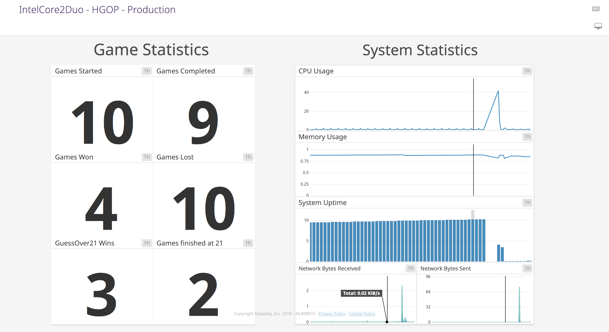

# HGOP

## Team Members:
Daníel Ekaphan Valberg - danielv16@ru.is - KT: 211096-2339  
Einar Orri Þormar - einart16@ru.is - KT: 081292-2139

## Week 1

URL to instance running api:
- **Daniel's:** [http://ec2-34-227-161-151.compute-1.amazonaws.com:3000/status](http://ec2-34-227-161-151.compute-1.amazonaws.com:3000/status) (this one has been terminated)
- **Einar's** - [http://ec2-52-207-255-176.compute-1.amazonaws.com:3000/status](http://ec2-52-207-255-176.compute-1.amazonaws.com:3000/status)

We are both running Ubuntu 18.04 LTS, we have not gotten the chance to test everything on Mac OSX. Everything has worked flawlessly on our machines so far, but the only concerns are minor things like verify_environments.sh, some commands may be different on Macs!

## Week 2

**Jenkins instance:** [http://ec2-54-159-34-3.compute-1.amazonaws.com:8080/](http://ec2-54-159-34-3.compute-1.amazonaws.com:8080/) (One of us switched to a new computer and the KeyPair did not work properly so we had to work around it and get a new domain)

Our game-api instance IP is listed in the deployment log as requested. The API calls are as follows:

**GET** requests:
```
{IP}:3000/status           - To check if API is up and running
{IP}:3000/state            - To get the game's state
```

**POST** requests:
```
{IP}:3000/start            - Start a game if non is running
{IP}:3000/guess21OrUnder   - Guess 21 or under
{IP}:3000/guessOver21      - Guess over 21

--- following is not implemented but callable ---

{IP}:3000/stats            - Should post stats to database

```

**NOTES:** While working on the project we did not focus too much on branching, as we believe that at this set-up stage, before having the Deploy job on Jenkins that it was not too necessary. Going onwards we plan to branch to a development branch.

We implemented all the TODOS: as well as we could. Hopefully we did not miss out any like last time!

There may be some extra files that have been created and are in use. ```.dockerignore``` is used to ignore files that we do not want to copy over to our container/image. ```package-lock.json``` just to keep packages locked, as ESLint google extension requested.

## Week 3

**Jenkins instance:** [http://ec2-54-159-34-3.compute-1.amazonaws.com:8080/](http://ec2-54-159-34-3.compute-1.amazonaws.com:8080/)

### DataDog stats

*We decided to add monitors for Capacity test and API test. They appear/updates only when pipeline is run*

*all data are queried within last hour*

**Production:** [https://p.datadoghq.com/sb/ceb143800-af7a9831adc4ce795f9d4913ded58246](https://p.datadoghq.com/sb/ceb143800-af7a9831adc4ce795f9d4913ded58246)

**Capacity test:** [https://p.datadoghq.com/sb/ceb143800-7ddd9dffd582e73773b92d0ed091106e](https://p.datadoghq.com/sb/ceb143800-7ddd9dffd582e73773b92d0ed091106e)

**API test:** [https://p.datadoghq.com/sb/ceb143800-469b137f318b7f1ede4402388c344740](https://p.datadoghq.com/sb/ceb143800-469b137f318b7f1ede4402388c344740)



> API and Capacity Test dashboards are identical

**Notes:**
- Accidentally deleted the original pipeline in Jenkins hence the low number of builds.
- We changed the dockerfile for game-api to do `CMD npm run build && npm run start` to get the images to load in the UI. We did this before the yarn installation was updated on day 12. It works well for us and does not have impact on image build time.
- Capacity test stage runs 2000 tests under 2 minutes. Takes about 30 seconds to do so. 
- Added several DataDog metrics, they can be seen in the monitor links above.
- DataDog was put into context and its own constructor file to keep things more consistent, even though it seems it was not required.
- Renamed `docker_build.sh` and `docker_push.sh` and split them up to do for both API and Client so we could split them in the stages aswell.
- Split things into more stages to have a better visualization of the pipeline so we can see better where things fail.

## Folder structure

*updated on day13 submission (14/12/2018)*

```
├── Jenkinsfile
├── README.md
├── aboutme.md
├── assignments
│   ├── day01
│   │   └── answers.md
│   ├── day02
│   │   └── answers.md
│   └── day11
│       └── answers.md
├── docker-compose.yml
├── game-api
│   ├── Dockerfile
│   ├── app.js
│   ├── config.js
│   ├── context.js
│   ├── database.js
│   ├── database.json
│   ├── dealer.js
│   ├── dealer.unit-test.js
│   ├── deck.js
│   ├── deck.unit-test.js
│   ├── inject.js
│   ├── lucky21.js
│   ├── lucky21.unit-test.js
│   ├── migrations
│   │   ├── 20181211061645-GameResultTable.js
│   │   └── 20181211184450-GameResultTableAddInsertDate.js
│   ├── package-lock.json
│   ├── package.json
│   ├── random.js
│   ├── random.unit-test.js
│   ├── server.api-test.js
│   ├── server.capacity-test.js
│   ├── server.js
│   ├── server.lib-test.js
│   └── statsD.js
├── game-client
│   ├── Dockerfile
│   ├── README.md
│   ├── cards
│   │   ├── *
│   ├── index.js
│   ├── package-lock.json
│   ├── package.json
│   ├── src
│   │   ├── App.css
│   │   ├── App.js
│   │   ├── components
│   │   │   └── AppContainer.js
│   │   ├── index.css
│   │   ├── index.html
│   │   └── utils.js
│   └── yarn.lock
├── infrastructure.tf
└── scripts
    ├── deploy.sh
    ├── docker_build_api.sh
    ├── docker_build_client.sh
    ├── docker_compose_up.sh
    ├── docker_push_api.sh
    ├── docker_push_client.sh
    ├── initialize_game_api_instance.sh
    ├── sync_session.sh
    └── verify_environment.sh
```